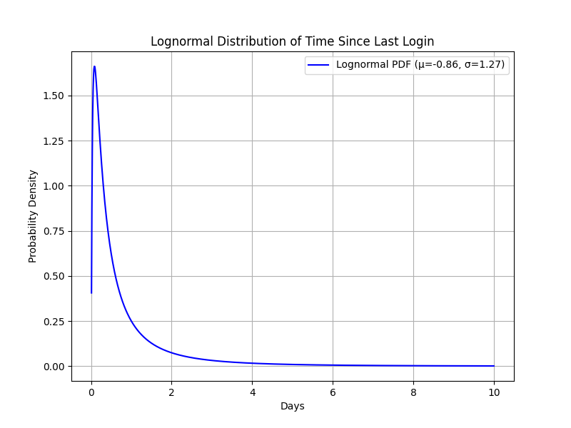
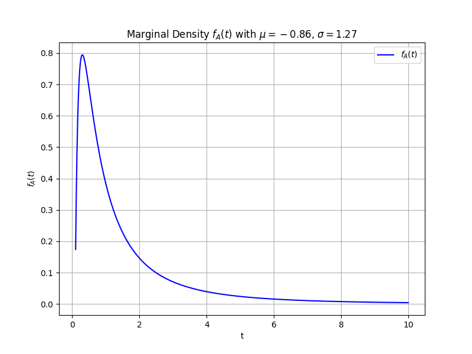

# Report on member activity level

## Abstract

This file gives a valuation on member activity level, and we would use this data to assess the accumulating speed of game item <abbr title="Donation can increase Alliance droid's building progress by 1 point">Droid Shard</abbr> so as to assist related decisions. The data can also be used for further purposes for more events, alliance activities.

**tl:dr;**
- valuate how active members are in our alliance
- assess the number of Droid Shards we get per day
[click this link to go to the conclusion](#conclusion)

## Statistics on member activity level

The following table displays data on the last time they log to their game account:

|1d or less|1\~2d|2\~3d|3\~5d|5\~7d|7d or more|
|-|-|-|-|-|-|
|59|8|6|3|2|93|

^Data^ ^collected^ ^on^ ^8pm,JST,May9.^

It's not hard to notice that most players are active while there're also plenty that haven't logged in for long. For simplicity, we assume members logging in within 7 days contribute to game activities, while the 93 inactive members (7d or more) do not.

let $f(t)$ to be the [PDF](https://en.wikipedia.org/wiki/Probability_density_function) of member accessing the game last time,   
then using log-normal distribution we have

$$ f(t)=\frac{1}{x\sigma\sqrt{2\pi}}\exp\left(-\frac{(\ln{x}-\mu)^2}{2\sigma^2}\right) $$

Using [MLE](https://en.wikipedia.org/wiki/Maximum_likelihood_estimation), we get $\mu=-0.86, \sigma=1.27$ as graphed below.

let $A$ be the number of days the user access the game once and $B(t)$ for last log, then obviously  

$$ f_{A|B}(x|t) = \frac{t}{x^2} \exp\left( \frac{1}{2\sigma^2} \left( \ln \frac{t x}{e^{2\mu}} \right) \ln \frac{t}{x} \right) \cdot \left( 1 + \frac{\ln x - \mu}{\sigma^2} \right) $$  

so  

$$ f_A(t) = \frac{1}{t \sigma \sqrt{2\pi}} \exp\left(-\frac{(\ln t - \mu)^2}{2\sigma^2}\right) \left[ 1 + \frac{\ln t - \mu}{\sigma^2} \right], \quad t > 0 $$

Ignore the error close to 0.

## Analysis on ways to get Droid Shards

Commonly, droid shards are get in the following approaches:
- Reward Quests (Daily)
- Island Battle
- Lucky Fortune (During weekends)
- Pop stars (Monthly)
No data on its ranking reward, so we'd skip it for now.

### Analysis on Reward Quests:
- 1 shard for 1^st^ reward quest complete
- 2 shards for 10^th^ reward quest complete

### Analysis on Island Battles:
Most users complete Island battles to Stage 15 and uses rush, so it's ok to use my data for an average player.
- 1 shard 1 out of 2 times
- no shard / 2 shards 1 out of 4 times

### Analysis on Lucky Fortune:
- 5 free draws per day (10min CD)
- 9.5% chance for a droid shard
- only available during weekends

No relevant data is provided for users buying luck fortune using gems, so let's put it aside.

## Estimation of Droid Shard Accumulation

Using the statistical models and activity data, we can estimate the daily accumulation of Droid Shards in the alliance. This section integrates member activity levels with the mechanics of Droid Shard acquisition to provide a comprehensive estimate.

### Member Activity Contribution

From the provided data, 59 members log in daily (1d or less), 8 members log in every 1-2 days, 6 every 2-3 days, 3 every 3-5 days, and 2 every 5-7 days. Using the marginal density function $f_A(t)$, we approximate the frequency of logins for active members.

The expected login frequency per member can be derived from $f_A(t)$. Given the log-normal parameters ($ \mu = -0.86, \sigma = 1.27 $), the mean login interval is approximately $E[A] = e^{\mu + \sigma^2/2} \approx 0.84$ days, meaning active members log in roughly every 0.84 days (or ~1.19 times per day). For the 78 active members, we estimate total daily logins as:

$$
78 \times 1.19 \approx 93 \text{ logins per day.}
$$

### Droid Shard Contributions

#### Reward Quests
Each member completing Reward Quests earns:
- 1 shard for the 1st quest.
- 2 shards for the 10th quest.

Assuming all active members complete at least the 1st quest daily, and 80% complete the 10th quest (a reasonable estimate for active players), daily shards from Reward Quests are:

$$
(93 \times 1) + (93 \times 0.8 \times 2) \approx 93 + 149 = 242 \text{ shards.}
$$

#### Island Battles
For Island Battles, the average shard yield per attempt is:
- 1 shard (50% chance) = \( 0.5 \times 1 = 0.5 \)
- 0 shards (25% chance) = \( 0.25 \times 0 = 0 \)
- 2 shards (25% chance) = \( 0.25 \times 2 = 0.5 \)

Total expected shards per battle: \( 0.5 + 0 + 0.5 = 1 \) shard.

Assuming each active member completes one Island Battle per login (a conservative estimate, as some may do more), daily shards from Island Battles are:

$$
93 \times 1 = 93 \text{ shards.}
$$

#### Lucky Fortune (Weekends Only)
Lucky Fortune offers 5 free draws per day with a 9.5% chance of a shard per draw. Expected shards per member per weekend day:

$$
5 \times 0.095 = 0.475 \text{ shards.}
$$

On weekends, daily shards from Lucky Fortune (for 93 logins):

$$
93 \times 0.475 \approx 44 \text{ shards.}
$$

Since Lucky Fortune is only available on weekends (2 out of 7 days), its weekly contribution is averaged over the week:

$$
\frac{44 \times 2}{7} \approx 12.6 \text{ shards per day.}
$$

### Total Daily Droid Shard Estimate
Combining contributions from all sources:

$$
242 \text{ (Reward Quests)} + 93 \text{ (Island Battles)} + 12.6 \text{ (Lucky Fortune)} \approx 347.6 \text{ shards per day.}
$$

## Conclusion
Based on the analysis, the alliance accumulates approximately **348 Droid Shards per day** from active members. This estimate accounts for daily logins, Reward Quests, Island Battles, and weekend Lucky Fortune draws. These findings can guide decisions on alliance strategies, such as prioritizing events or optimizing quest completion rates. For further analysis, collecting data on Pop Stars rewards and gem-based Lucky Fortune purchases could refine the estimate.

This report provides a baseline for assessing Droid Shard accumulation and can be extended to evaluate other in-game resources or event participation.
